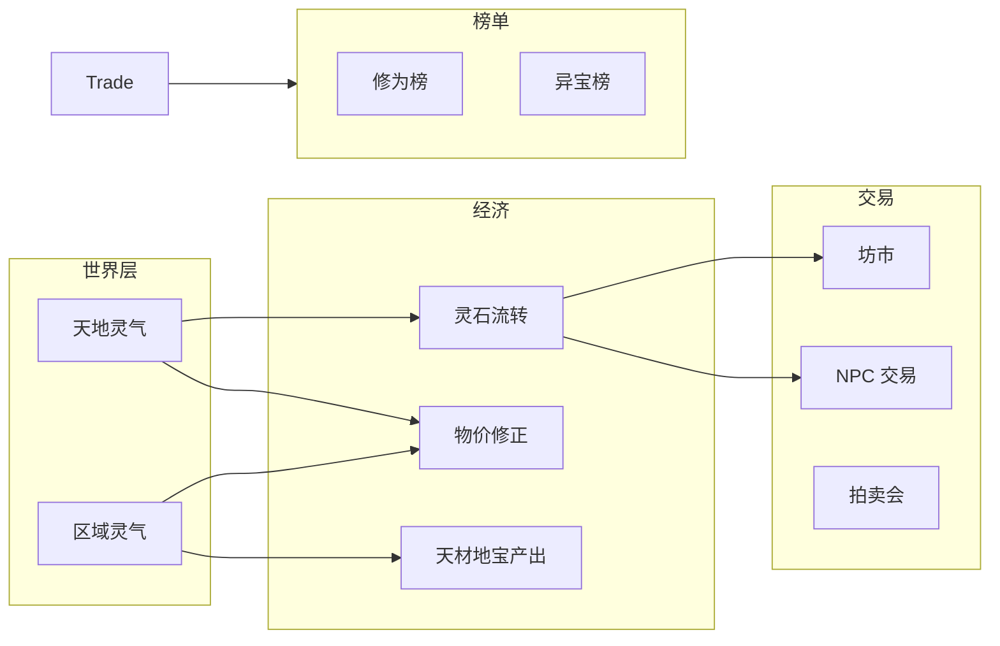

# 基于 AI 的玩法扩展：交易系统、灵气经济与异宝榜

## 一、现状与目标

- **已有**：城镇坊市 Buy/Sell（[src/classes/action/buy.py](src/classes/action/buy.py)、[sell.py](src/classes/action/sell.py)）、拍卖会（[auction.py](src/classes/gathering/auction.py)）、流通池（[circulation.py](src/classes/circulation.py)）；区域仅有洞府/遗迹有灵气（[CultivateRegion](src/classes/environment/region.py)），普通区域无灵气；采集数量固定（[execute_gather](src/utils/gather.py)）；天骄榜前端（[RankingPanel.vue](web/src/components/game/panels/RankingPanel.vue)）数据来自 `avatar_list`，无后端排行 API。
- **目标**：  
  1. **交易系统**：NPC 间交易、坊市物价与灵气/供需挂钩，并用 AI 生成交易叙事。
  2. **灵石流转与天地灵气关联**：引入「天地灵气」概念，灵脉/灵矿产出灵石、修炼消耗灵石，使灵石总量与灵气挂钩。
  3. **天材地宝与灵气关联**：普通区域可带灵气浓度，采集产出数量/概率与区域灵气挂钩。
  4. **异宝榜**：榜单数据源（角色装备 + 流通名器），后端 API + 前端新 Tab，可选 AI 生成异宝描述。

---

## 二、架构概览

---

## 三、详细设计

### 3.1 天地灵气与灵石流转

**数据层**

- 在 [World](src/classes/core/world.py) 上增加可选「世界天地灵气」：
  - 方案 A：单一标量 `world_spirit_qi: float`（0.0～1.0 或 0～10），表示大环境灵气水平。
  - 方案 B：沿用现有 [CelestialPhenomenon](src/classes/celestial_phenomenon.py)，用 `current_phenomenon` 提供全局灵气修正（已有则扩展效果字段）。
- 建议：**方案 A** 增加 `world_spirit_qi`，便于与「灵脉产出」「物价系数」直接公式挂钩；`current_phenomenon` 可在此基础上做事件型修正（如「灵气潮汐」临时乘数）。

**灵石流转规则（与天地灵气关联）**

- **灵脉/灵矿产出**（新增月度或年度结算）：
  - 仅在有「灵脉」或高灵气区域（洞府、或为 NormalRegion 扩展的「灵脉」标记）结算：每周期产出灵石 = 基础量 × `world_spirit_qi`（或 × 区域灵气系数）。产出注入方式二选一：注入「区域坊市资金池」或直接给「占据该区域的角色/宗门」。
- **修炼消耗**（可选，轻量）：
  - 在 [Respire](src/classes/action/respire.py) 或月度结算中：高境界/高灵气消耗少量灵石（公式与 `world_spirit_qi` 或区域灵气相关），使灵石有「沉没」出口，避免无限通胀。
- **流通统计**：
  - 在 [CirculationManager](src/classes/circulation.py) 或 World 上增加「世界当前灵石总量」统计（所有存活角色 `magic_stone` 之和）；可选：记录历史曲线用于平衡与调试。不强制「灵石守恒」，允许系统商店/灵脉注入与修炼消耗造成净增/净减。

**配置**

- 在 [config.yml](static/config.yml) 的 `game` 下增加：`world_spirit_qi_initial`、`spirit_vein_output_base`、`respire_spirit_stone_cost_factor`（若做修炼消耗）等，便于调参。

---

### 3.2 天材地宝产生与灵气关联

**区域灵气扩展**

- [NormalRegion](src/classes/environment/region.py) 当前无灵气字段。扩展方式：
  - 为 NormalRegion 增加可选 `essence_density: int`（0～10，默认 0），表示「天地灵气在此地的浓度」；或简化为单标量 `spirit_qi: float`。
- 地图生成/静态数据：
  - 在 [map_generator.py](src/run/map_generator.py) 或 [load_map.py](src/run/load_map.py) 中，为每个 NormalRegion 根据地形或配置赋予 `essence_density`/`spirit_qi`（如山脉、林海略高，荒漠略低）。

**采集数量与灵气挂钩**

- 在 [execute_gather](src/utils/gather.py) 中：
  - `base_quantity` 或额外产出概率改为：与 `region.essence_density`（或 `spirit_qi`）正相关（例如 `base_quantity = 1 + floor(essence_density / 3)` 或按概率多给 1 份）。
  - 保持「境界匹配」等现有逻辑不变，仅修正数量/概率。

**天材地宝定义**

- 现有 [Material](src/classes/material.py)/[Plant](src/classes/environment/plant.py)/[Lode](src/classes/environment/lode.py) 已能表达「高境界」稀有材料；若需「异宝」专指装备，见 3.4 异宝榜。此处「天材地宝」泛指高价值材料与产出，其「产生数量」与灵气关联即可。

---

### 3.3 交易系统扩展（含 AI）

**坊市物价与灵气/供需**

- 在 [Prices](src/classes/prices.py) 中扩展：
  - `get_buying_price` / `get_selling_price` 增加可选参数：`region` 或 `world_spirit_qi`。
  - 公式：基础价 × 境界系数 × (1 + 灵气系数 × (world_spirit_qi - 0.5))，使高灵气时部分物品略贵（稀缺）或略便宜（产出多），依设计选择方向；或仅对「材料」与灵气挂钩，装备仍以境界为主。
- 可选：城镇 [CityRegion](src/classes/environment/region.py) 的 `prosperity` 与本地或世界灵气、交易量挂钩，再影响该城物价系数（二次设计时可做）。

**NPC 与 NPC 交易（AI 丰富）**

- 新增「NPC 间交易」事件：在月度/年度或事件轮中，随机或条件触发「两 NPC 达成交易」。
  - 逻辑：选择同区域或可交互的两人，检查一方有冗余物品/灵石、另一方有需求（可用现有 [Auction](src/classes/gathering/auction.py) 的 LLM 需求模板思路，或简化为境界/类型匹配），协商价格可在「系统价 ± 随机浮动」内，由 LLM 生成短句叙事（如「甲以 XX 灵石将 YY 卖与乙」）。
- 实现位置：新模块如 `src/classes/trade/npc_trade.py` 或放在 `src/systems/` 下，由 [Simulator](src/sim/simulator.py) 在合适阶段调用；交易结果：转移灵石/物品，并写入 [Event](src/classes/event.py)，供事件流与年鉴展示。
- **AI**：调用 [call_llm_with_template](src/utils/llm/client.py)，模板输入为双方简况、物品、价格；输出为 1～2 句古风交易描述，写入 Event.content。

**玩家/天道干预（可选）**

- 若存在「天道权能」或玩家指令：可增加「引导交易」权能（如让指定两人更容易触发交易或强制触发一次），复用上述 NPC 交易逻辑并标记事件来源。

---

### 3.4 异宝榜

**数据源**

- 「异宝」指：高价值兵器、辅助装备（及可选：世界唯一法宝、器灵觉醒等）。
- 来源：
  - 所有存活角色当前装备的 `weapon`、`auxiliary`；
  - [CirculationManager](src/classes/circulation.py) 中的 `sold_weapons`、`sold_auxiliaries`（未再流入角色前的「世间流传」名器）。
- 去重与排序：按「境界」为主、其次战力加成/稀有度/认主度等，取 Top N（如 20）作为异宝榜。

**后端 API**

- 新增 `GET /api/meta/rankings`（或沿用现有规划中的该路径）：返回多种排行榜。
  - 现有前端 [RankingPanel.vue](web/src/components/game/panels/RankingPanel.vue) 使用 `worldStore.avatarList`，无专门排行接口；可统一改为调用本 API。
  - 返回结构示例：`{ "realm": [...], "sect": [...], "age": [...], "treasure": [...] }`。
  - `treasure` 每条：`item_id`、`name`、`grade`（境界）、`type`（weapon/auxiliary）、`owner_id`/`owner_name`（若在角色身上）或 `in_circulation: true`、可选 `description`（AI 生成短句）。
- 实现：在 [main.py](src/server/main.py) 中新增路由；排行计算可在 `main.py` 内实现，或抽到 `src/systems/rankings.py`：遍历 `world.avatar_manager.avatars` 与 `world.circulation`，收集装备与流通装备，排序后序列化。

**前端**

- 在 [RankingPanel.vue](web/src/components/game/panels/RankingPanel.vue) 增加 Tab「异宝榜」，展示 `treasure` 列表；点击条目可跳转至持有者（若有）或展示流通状态；若有 `description` 则展示 AI 描述。

**AI 描述（可选）**

- 对异宝榜 Top 10（或全部）调用 LLM：输入为物品名、境界、类型、当前持有者/流通，输出一句古风异宝描述，写入 API 返回的 `description` 字段；可做缓存（按 item_id + 持有者变更刷新），避免每请求都调 LLM。

---

## 四、文件与改动清单

| 模块     | 文件                                                                                                      | 改动要点                                             |
| ------ | ------------------------------------------------------------------------------------------------------- | ------------------------------------------------ |
| 世界灵气   | [world.py](src/classes/core/world.py)                                                                   | 增加 `world_spirit_qi: float`，存档/读档                |
| 配置     | [config.yml](static/config.yml)                                                                         | `world_spirit_qi_initial`、灵脉/修炼消耗相关项             |
| 灵石流转   | 新 `src/systems/spirit_economy.py` 或扩展现有 systems                                                         | 灵脉产出、可选修炼消耗、月度/年度调用                              |
| 区域灵气   | [region.py](src/classes/environment/region.py)                                                          | NormalRegion 增加 `essence_density` 或 `spirit_qi`  |
| 地图     | [map_generator.py](src/run/map_generator.py)、[load_map.py](src/run/load_map.py)                         | 为 NormalRegion 赋灵气初值                             |
| 采集     | [gather.py](src/utils/gather.py)                                                                        | `execute_gather` 中数量/概率与区域灵气挂钩                   |
| 物价     | [prices.py](src/classes/prices.py)                                                                      | 价格接口增加 world/region 灵气参数及系数                      |
| NPC 交易 | 新 `src/classes/trade/npc_trade.py` 或 `src/systems/npc_trade.py`                                         | 触发条件、议价、LLM 叙事、写 Event                           |
| 模拟器    | [simulator.py](src/sim/simulator.py)                                                                    | 调用灵脉产出、NPC 交易（按周期）                               |
| 排行榜    | 新或扩 [main.py](src/server/main.py)、可选 [rankings.py](src/systems/rankings.py)                             | `GET /api/meta/rankings`，含 `treasure`；异宝 AI 描述可选 |
| 前端     | [RankingPanel.vue](web/src/components/game/panels/RankingPanel.vue)、[world.ts](web/src/stores/world.ts) | 请求 rankings API、新增异宝榜 Tab、展示 description         |
| 前端类型   | [api.ts](web/src/types/api.ts) 等                                                                        | rankings 响应类型定义                                  |

---

## 五、实施顺序建议

1. **灵气与数据层**：World 增加 `world_spirit_qi`，NormalRegion 增加灵气字段，地图加载/生成赋初值；config 增加项。
2. **灵石流转**：灵脉产出（及可选修炼消耗）与 `world_spirit_qi` 挂钩，在 Simulator 中挂到月度/年度。
3. **天材地宝-灵气**：`execute_gather` 与区域灵气挂钩。
4. **物价-灵气**：Prices 接入灵气系数（先世界灵气即可）。
5. **异宝榜**：后端 rankings API（含 treasure）、前端异宝 Tab；可选异宝描述 LLM。
6. **NPC 交易与 AI**：NPC 交易逻辑 + LLM 叙事，Simulator 中按周期触发。

以上顺序可保证「灵气 → 经济 → 榜单 → 叙事」的依赖清晰，且每步可单独测试与回滚。